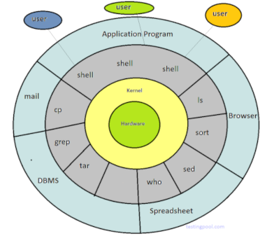
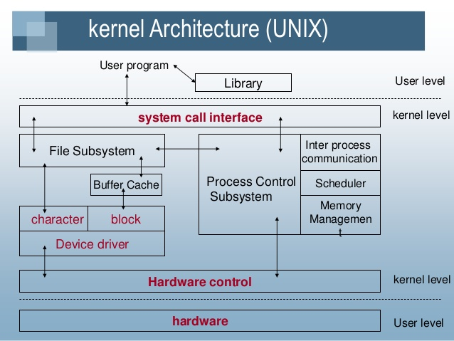

Author  : [Srinikethan Mankala
    ](mailto:sriz1392@gmail.com)
# Understanding Internals of Unix & Linux Kernel

## Operating System
An interface between computer hardware and User. 

*Types of Operating System:*
* __Single User__ - Single Tasking OS 
    Only one user can log into system and can perform only one task at a time.  
    Ex: MS-DOS

* __Single User__ - Multitasking OS
    Supports only one user to log into the system but a user an perform multiple tasks
    at a time.  
    Ex: Windows -98, XP, Vista etc.

* __Multi  User__ - Multitasking OS
    Supports multiple users to log into the system and also each user can perform various tasks 
    at a time. ie resources can be shared amongst multiple users. 
    Ex: Unix, Linux etc.

> __Open Standards Foundation is a UNIX industry organisation designed to keep various UNIX flavours working together.
>    They created OS guidlines called POSIX to encourage inter-operability of applications from one flavour to another__
<!-- --------------------------------------------------------------------------------------------- -->

## Introduction to UNIX
* Unix is Written in high-level language -> hence easy to read, understand , change and move.
* It has a simple but power user interface  
* Unix has a hierarchial file system -> allows easy maintenance and efficient implementation
* Multi-user, multi-processing system

#### UNIX Principles
*   __*Everything is a file*__ - Unix system has many powerful utilities designed to create and manipulate files.
    The Unix security model is based on around the security of files. By treating everything as a file, you can secure access to hardware   in the same way as you secure access to a document.

*   __*Configuration data stored in text*__ - Storing configuration in text allows an administrator to move a config from one machine to        another easily, provide ability to roll back a system config to particular date and time.

* __*Small single purpose programs*__ - Unix provides many utilities

* __*Avoid captive User interfaces*__
  
* __*Ability to chain programs to perform complex tasks*__ - A core design feature of unix is that output of one program can be input for       another.
  
  
<!-- --------------------------------------------------------------------------------------------- -->

*   The main concept that unites all the versions of Unix is the following basics −

     * __Kernel__ − The kernel is the heart of the operating system. It interacts with the hardware and most of the tasks like memory management, task scheduling and file management. It manages resources , schedules tasks and controls security.

    * __Shell__ − The shell is the utility that processes your requests. When you type in a command at your terminal, the shell interprets the command and calls the program that you want. The shell uses standard syntax for all commands. C Shell, Bourne Shell and Korn Shell are the most famous shells which are available with most of the Unix variants.

    * __Commands and Utilities__ − There are various commands and utilities which you can make use of in your day to day activities. cp, mv, cat and  grep, etc. are few examples of commands and utilities. There are over 250 standard commands plus numerous others provided through 3rd party software. All the commands come along with various options.

<!-- --------------------------------------------------------------------------------------------- -->

  
### UNIX Architecture

  

  
"*the Onion architecture*"
  

<!-- --------------------------------------------------------------------------------------------- -->

### User Perspective

#### FILE Subsystem
>>
    * Hirearchical structure- as tree with root
    * Ability to create and delete files
    * Dynamic growth of files.
    * Protection of file data - access permissions for three classes of users. (owner, group, others)
    * Treatment of peripheral devices as files.
>>
  
<!-- -------------------------------------------------------------------------------------------- -->

#### PROCESS Subsystem
>>
    * Program is an executable.
    * Process is a program in execution.
    * Multiprogramming / Multi tasking -- all process run parallel in the background
    * System calls for controlling processes
    * Shell is a command line interpreter

    Process environment
        > Process control : fork () -> creates a new child
                            exec () -> execute a program
                            wait () -> wait for the program to execute
                            exit () -> kill the process once its done

        > Shell 3 types of commands :  Internal command
                                       External command
                                       Script files (executables) 
>>

<!-- ----------------------------------------------------------------------------------------- -->

  
  
### File Management
In Unix, there are three basic types of files −

*   __Ordinary Files__ − An ordinary file is a file on the system that contains data, text, or program instructions. In this tutorial, you look       at working with ordinary files.

*   __Directories__ − Directories store both special and ordinary files. For users familiar with Windows or Mac OS, Unix directories are              equivalent to folders.

*   __Special Files__ − Some special files provide access to hardware such as hard drives, CD-ROM drives, modems, and Ethernet adapters.            Other special files are similar to aliases or shortcuts and enable you to access a single file using different names.

File ownership is an important component of Unix that provides a secure method for storing files. 
Every file in Unix has the following attributes −

* __Owner permissions__ − The owner's permissions determine what actions the owner of the file can perform on the file.

* __Group permissions__ − The group's permissions determine what actions a user, who is a member of the group that a file belongs to, can perform on the file.

* __Other (world) permissions__ − The permissions for others indicate what action all other users can perform on the file.
  
<!-- ----------------------------------------------------------------------------------------- -->